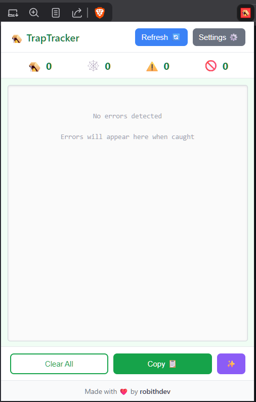
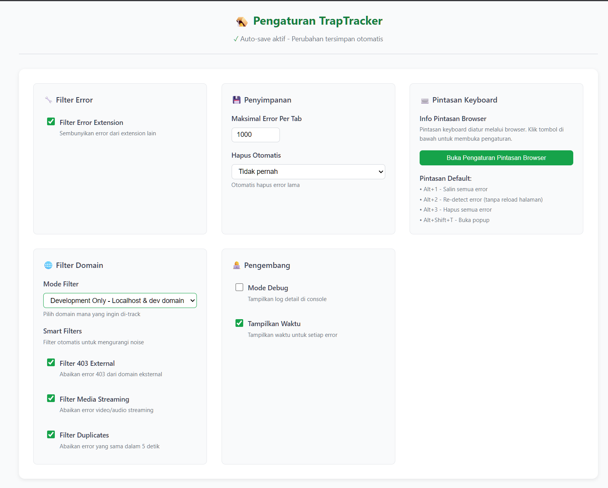

# 🪤 TrapTracker - Chrome Extension for Web Development Debugging

[](https://github.com/traptracker/traptracker-extension)
[](LICENSE)
[](https://chrome.google.com/webstore)

> **Catch Every Trap, Fix Every Bug** - A zero-configuration error tracking extension for web developers

TrapTracker is a powerful Chrome extension designed to capture and track all types of errors during web development, with special optimization for Laravel developers. No setup required - just install and start debugging!

## ✨ Key Features

### 🚀 Zero Configuration Required
- **Instant Setup**: Works immediately after installation
- **Automatic Error Capture**: JavaScript errors, network failures, console messages
- **Smart Detection**: Automatically detects Laravel, React, Vue, and other frameworks
- **Real-time Tracking**: See errors as they happen with badge notifications

### 🎯 What Gets Captured

| Error Type | Description | Coverage |
|------------|-------------|----------|
| **JavaScript Errors** | Runtime exceptions, syntax errors, type errors | 100% |
| **Console Messages** | All console.log, warn, error, info, debug | 100% |
| **Network Errors** | Failed API calls (4xx/5xx), timeouts | 100% |
| **Promise Rejections** | Unhandled promise errors | 100% |
| **Resource Loading** | Failed images, scripts, stylesheets | 90% |
| **Laravel Exceptions** | Ignition errors, validation failures | Auto-detected |

### 🛠️ Developer Experience
- **Clean UI**: Minimalist popup with error statistics
- **Keyboard Shortcuts**: `Alt+1` (Copy), `Alt+2` (Refresh), `Alt+3` (Clear)
- **Smart Filtering**: Automatic noise reduction (ads, extensions, duplicates)
- **Domain Filtering**: Focus on development domains only

## 📸 Screenshots

### Extension Popup

*Real-time error tracking with categorized error counts*

### Settings Page

*Configure domain filtering, smart filters, and auto-clear options*

## 📥 Installation

### From Source (Development)
```bash
# Clone repository
git clone https://github.com/RobithYusuf/trap-tracker.git
cd trap-tracker

# Load in Chrome
1. Open chrome://extensions/
2. Enable "Developer mode"
3. Click "Load unpacked"
4. Select the trap-tracker folder
```

### Chrome Web Store (Coming Soon)
- Search "TrapTracker" in Chrome Web Store
- Click "Add to Chrome"
- Start debugging immediately!

## 🎮 Usage

### Basic Usage
1. **Install** the extension
2. **Navigate** to your development site
3. **Errors appear** automatically in the extension icon badge
4. **Click icon** to see error summary
5. **Use DevTools** panel for detailed analysis

### Viewing Errors
- **Extension Icon**: Shows error count badge
- **Popup Window**: Quick summary with categories
- **DevTools Panel**: Full error details with stack traces

### Copy Errors for Debugging
- Click **"Copy 📋"** to copy all errors in formatted text
- Errors are formatted for easy sharing and debugging

## 🏗️ Architecture

```
trap-tracker/
├── manifest.json                    # Extension configuration
├── assets/
│   └── icons/                      # Extension icons
├── src/
│   ├── background/
│   │   └── background.js          # Service worker & error aggregation
│   ├── content/
│   │   └── trap-tracker-content.js # Content script
│   ├── injected/
│   │   └── trap-tracker-capture.js # Page context error capture
│   ├── popup/
│   │   ├── popup.html             # Extension popup UI
│   │   └── popup.js               # Popup logic
│   ├── options/
│   │   ├── options.html           # Settings page
│   │   └── options.js             # Settings logic
│   └── devtools/
│       ├── devtools.js            # DevTools integration
│       └── panel.js               # Error panel logic
```

## ⚙️ Configuration Options

### Domain Filtering
- **All Domains**: Track errors on all websites
- **Development Only**: Only localhost and common dev ports
- **Custom**: Configure your own whitelist/blacklist

### Smart Filters (Enabled by Default)
- Filter external 403 errors
- Filter media streaming errors
- Prevent duplicate errors (5-second window)

### Supported Development Ports
3000-3010, 4000-4005, 4200, 5000-5005, 5173-5175, 8000-8015, 8080-8089, 9000-9009, and more!

## 🔧 For Laravel Developers

TrapTracker automatically detects Laravel applications and provides enhanced error tracking:

- **Ignition Error Parsing**: Extracts exception details from error pages
- **Stack Trace Enhancement**: Shows Laravel-specific file paths
- **Validation Error Detection**: Captures form validation failures
- **Framework Detection**: Identifies Laravel, Inertia.js, and other frameworks

### Optional Enhancement (Laravel)
```blade
{{-- Add to app.blade.php for richer context --}}
@if(config('app.debug'))
    <script>
        window.TrapTracker = {
            framework: 'Laravel',
            version: '{{ app()->version() }}'
        };
    </script>
@endif
```

## 📊 Performance Impact

- **Error Capture**: < 0.5ms overhead
- **Memory Usage**: ~5MB base + 2KB per error
- **CPU Usage**: < 1% during active capture

## 🚫 Limitations

- **CORS Details**: Limited by browser security
- **Production Use**: Designed for development only
- **Source Maps**: Not supported in v1.0
- **Memory Profiling**: Planned for future versions

## 🤝 Contributing

We welcome contributions! Please see [CONTRIBUTING.md](CONTRIBUTING.md) for guidelines.

### Development Setup
```bash
# Clone repo
git clone https://github.com/RobithYusuf/trap-tracker.git
cd trap-tracker

# No build process required!
# Just load unpacked extension in Chrome
```

## 📝 License

MIT License - see [LICENSE](LICENSE) file for details

## 🙏 Credits

Created with ❤️ by **robithdev**

---

**Note**: TrapTracker is designed for development environments only. For production error monitoring, consider using services like Sentry or Rollbar.